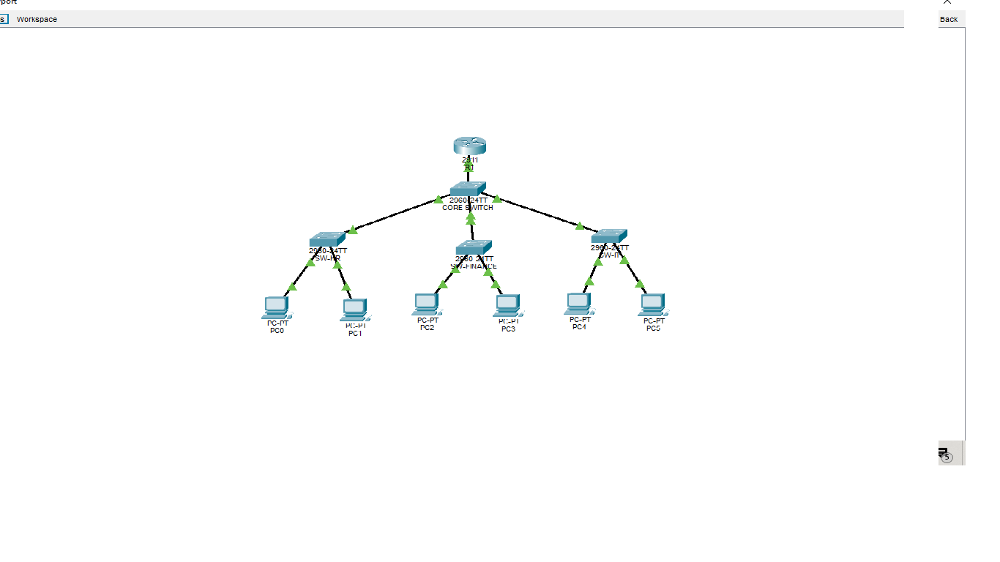
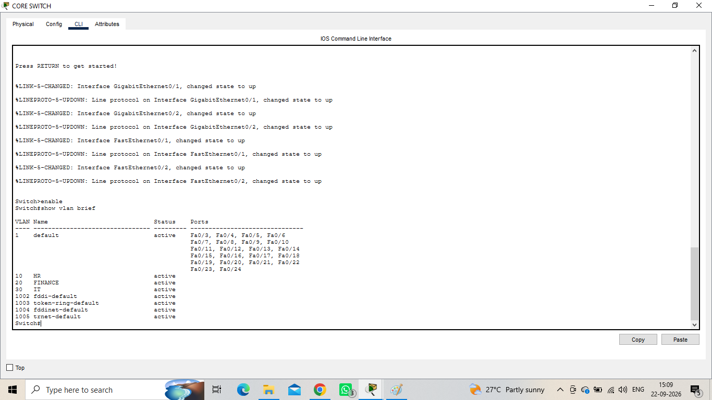
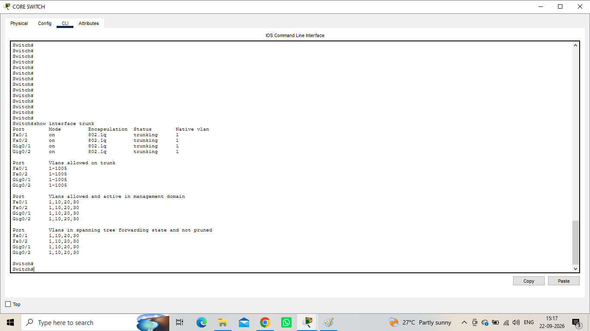
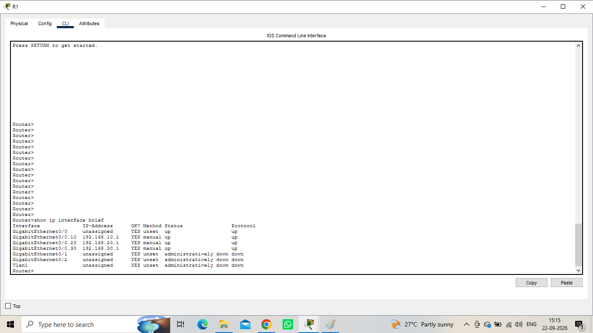
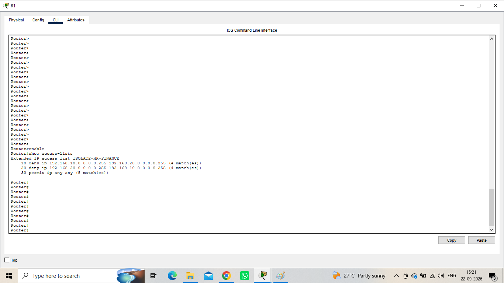

# Enterprise VLAN Network Security

A Cisco Packet Tracer project demonstrating VLAN segmentation, inter-VLAN routing, trunking, port security, and ACL-based departmental isolation.

## Project Overview

This network represents a small enterprise environment divided into three departments:

- **HR — VLAN 10**
- **Finance — VLAN 20**
- **IT — VLAN 30**

The network uses **Router-on-a-Stick** for inter-VLAN routing. An extended ACL isolates the HR and Finance networks from each other while allowing other traffic.

## Network Topology



## Key Features

- VLAN segmentation for HR, Finance, and IT
- Router-on-a-Stick inter-VLAN routing
- 802.1Q trunking
- Switch port security
- Extended ACL-based traffic filtering
- Cisco IOS verification and troubleshooting
- Connectivity and security testing

## IP Addressing

| Department | VLAN | Network | Gateway |
|------------|------|---------|---------|
| HR | 10 | 192.168.10.0/24 | 192.168.10.1 |
| Finance | 20 | 192.168.20.0/24 | 192.168.20.1 |
| IT | 30 | 192.168.30.0/24 | 192.168.30.1 |

## Security Design

HR and Finance are isolated from each other using an extended ACL.

```text
10 deny ip 192.168.10.0 0.0.0.255 192.168.20.0 0.0.0.255
20 deny ip 192.168.20.0 0.0.0.255 192.168.10.0 0.0.0.255
30 permit ip any any
```

## Security Policy

- HR → Finance: Denied
- Finance → HR: Denied
- IT → HR: Allowed
- IT → Finance: Allowed

Port security was also configured on departmental access ports.

## Configuration & Verification

### VLAN Configuration



### Trunk Configuration



### Router-on-a-Stick Configuration



### ACL Configuration



### Port Security Configuration


### Successful Security Test


### Blocked Security Test


## Verification Commands

```text
show vlan brief
show interfaces trunk
show ip interface brief
show access-lists
show ip interface GigabitEthernet0/0.10
```

## Project Files

- `Enterprise_VLAN_Network_Security.pkt`
- `configs/network-configuration.md`
- `topology.png`
- `VLANs.png`
- `Trunks.png`
- `router.png`
- `ACL.png`
- `port security.png`
- `successful security test.png`
- `blocked security test.png`

## Tools Used

- Cisco Packet Tracer
- Cisco IOS CLI
- GitHub

## Learning Outcomes

- VLAN segmentation
- 802.1Q trunking
- Router-on-a-Stick
- Inter-VLAN routing
- Extended ACLs
- Switch port security
- Network verification
- Connectivity testing
- Basic network troubleshooting
